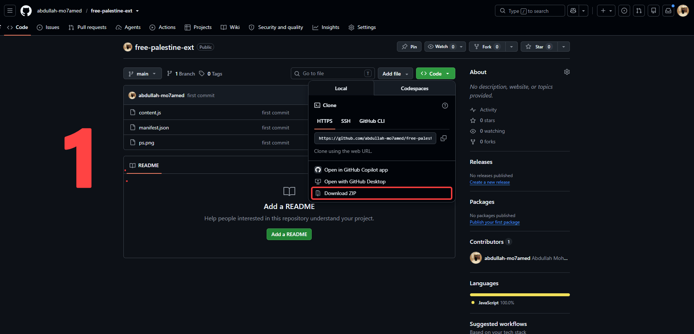
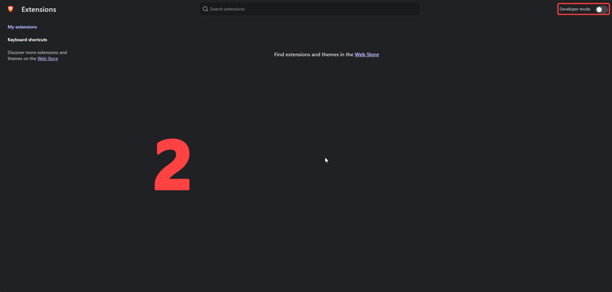
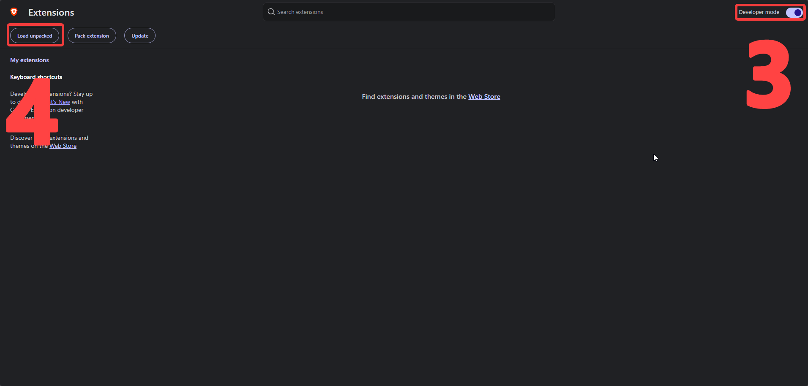
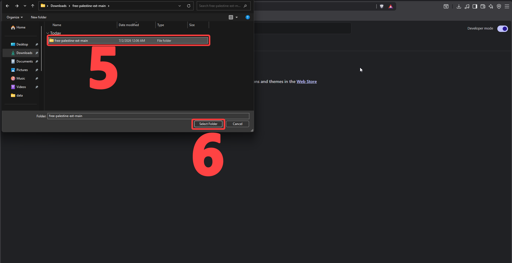
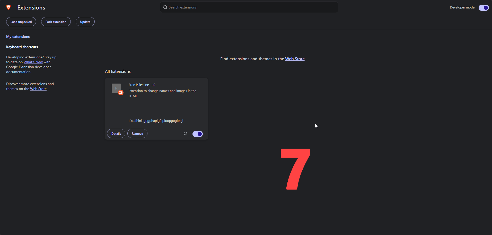
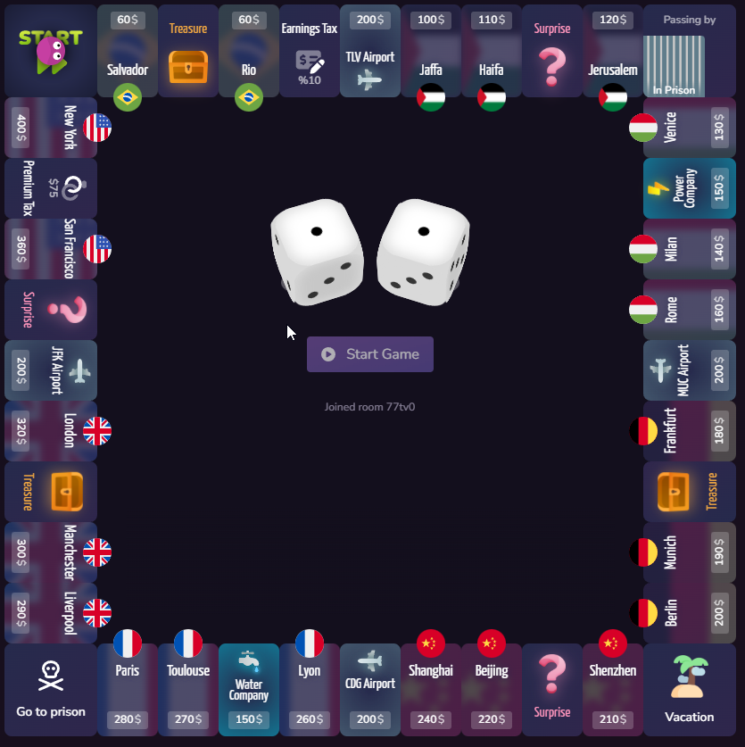

# Free Palestine Chrome Extension

A lightweight, SPA-friendly Google Chrome extension that dynamically corrects historical names and country flags on matched websites (such as `richup.io`).

## Features

- **Text Correction**: Automatically scans the page text nodes and dynamically replaces:
  - `Jerusalem` &rarr; **Al-Quds**
  - `Tel Aviv` (or `Tel-Aviv`) &rarr; **Jaffa**
- **Flag Replacement**: Automatically detects specific flag SVG nodes by matching their unique vector paths and replaces them with a local Palestine flag image (`ps.png`).
- **SPA Resilient (MutationObserver)**: Runs smoothly on Single Page Applications (SPAs). When you navigate to other pages/tabs and return, the extension immediately catches the DOM updates and reapplies the changes without lagging or infinite page loops.
- **Privacy & Performance Filter**: Ignores `<script>`, `<style>`, `<noscript>`, and `<textarea>` elements to avoid breaking any website mechanics.

---

## File Structure

```
free-palestine/
├── manifest.json   # Chrome Extension configuration
├── content.js      # Core DOM modification and observation script
├── ps.png          # Palestine flag image (local resource)
└── README.md       # Project documentation
```

---

## Installation Instructions

1. **Download/Clone this project** to your local machine. Ensure you have your Palestine flag image saved in this folder as **`ps.png`**.
   
   

2. Open Google Chrome (or any Chromium browser like Brave, Edge, or Opera) and navigate to `chrome://extensions/`.
   
   

3. Enable **Developer mode** using the toggle switch in the top-right corner.
   
   

4. Click the **Load unpacked** button in the top-left corner.
   
   

5. Select the `free-palestine` folder containing the extension files.
   
   

6. Navigate to [richup.io](https://richup.io) to see the extension running automatically!
   
   

---

## How It Works

### Local Image Referencing (`ps.png`)
Content scripts cannot load local extension resources directly via relative file paths (e.g. `img.src = "ps.png"`). To load `ps.png` securely, the extension:
1. Registers `ps.png` in `manifest.json` under `web_accessible_resources`.
2. Resolves the absolute internal extension URL dynamically in `content.js` using:
   ```javascript
   const flagUrl = chrome.runtime.getURL("ps.png");
   ```

### SVG Path Detection
Instead of fragile CSS selectors which break when site developers update layouts or style names, the script matches the SVG using its unique path coordinate layout:
```javascript
const path = svg.querySelector('path[d^="M352 200.575h-64.001L256"]');
```
Once detected, it swaps the SVG directly with the `ps.png` image.
